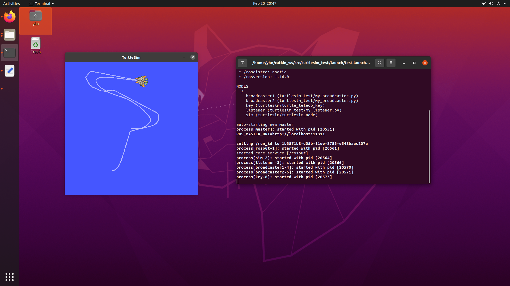

### turtlesim小乌龟跟踪

#### ROS安装

1.添加ROS软件源
  `sudo sh -c 'echo "deb http://packages.ros.org/ros/ubuntu $(lsb_release -sc) main" > /etc/apt/sources.list.d/ros-latest.list'`
2.添加密钥
  `sudo apt-key adv --keyserver 'hkp://keyserver.ubuntu.com:80'--recv-key C1CF6E31E6BADE8868B172B4F42ED6FBAB17C654`
3.安装ROS
  `sudo apt update`  
  `sudo apt install ros-noetic-desktop-full`
4.初始化rosdep
  `sudo rosdep init`  
  `rosdep update`
5.设置环境变量
  `echo "source /opt/ros/melodic/setup.bash" >> ~/.bashrc`  
  `source ~/.bashrc`

#### 创建工作空间`mkdir -p catkin_ws/src`

> 其中， `catkin_ws` 为工作空间名

`cd catkin_ws/src`

`catkin_init_workspace`

#### 创建ROS包

`cd ~/catkin_ws/src`

`catkin_create_pkg my_pkg roscpp rospy tf turtlesim`

然后，将 `my_broadcaster.py` 与 `my_listener.py` 放入 `my_pkg/scripts` 目录中

#### 运行

`source devel/setup.bash`

`roscore`

`rosrun turtlesim turtlesim_node`

`python3 my_broadcaster.py __name:=turtle1_tf_broadcaster /turtle1`

`python3 my_broadcaster.py __name:=turtle1_tf_broadcaster /turtle1`

`python3 my_listener.py`

`rosrun turtlesim turtle_teleop_key`

